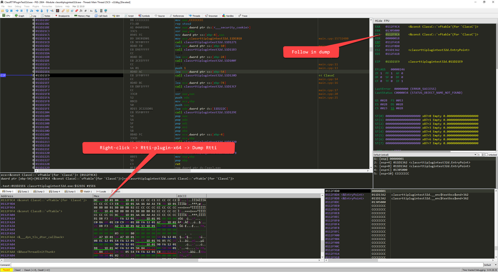

# x64dbg RTTI Plugin

A plugin to quickly retrieve RTTI information (if present) at a memory address.

There's a wealth of information present in RTTI that's of use when reverse engineering.  This plugin aims to make this information easily available to the user.

## Installation
1. Compile the solution in Release mode for x86 and x64.
2. Copy 'Rtti.dp32'in '.\Rtti-plugin-x64\Release' to your \x64dbg\release\x32\plugins directory.
3. Copy 'Rtti.dp64'in ' .\Rtti-plugin-x64\x64\Release' to your \x64dbg\release\x64\plugins directory.

## Usage

## Reporting Crashes

If you find a crash please submit an issue on gitlab.

## References
There are references for finding Rtti information included in the /docs directory.  Thanks to the authors of those papers:

[igorsk](http://www.openrce.org/profile/view/igorsk)

Paul Vincent Sabanal (Researcher, IBM Internet Security Systems X-Force R&D)

Mark Vincent Yason (Researcher, IBM Internet Security Systems X-Force R&D)